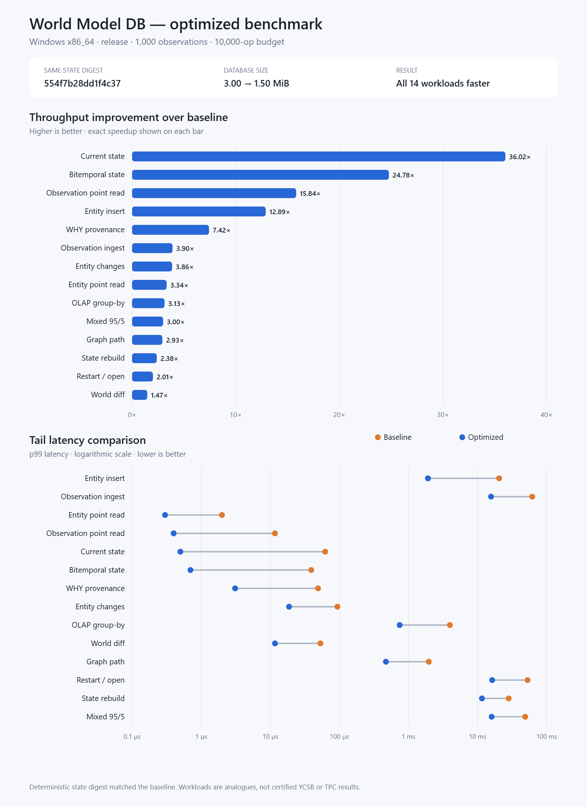

# World Model DB

**An open-source, agent-native database for shared, evidence-backed world state.**

World Model DB gives AI agents a durable memory that can answer more than
"what was last written?" It stores observations, resolves them into temporal
facts, preserves conflicting evidence, tracks who or what supplied each claim,
and can explain why the database currently believes something.

V0 is a single-node Rust implementation focused on getting the semantics right:
immutable observations, bitemporal facts, deterministic resolution, provenance,
conflicts, temporal graph traversal, and prompt-sized context retrieval.

> World Model DB does not claim to know objective truth. It maintains an
> inspectable, reproducible model of what is believed, when, and why.

## Why agents need a world model

Ordinary key-value memory overwrites the past. Vector search finds similar text
but does not establish evidence. A world model should let an agent ask:

- What do we currently believe about this entity?
- What was true at one time, and what did we know at another?
- Which source or agent made this claim?
- What changed, what conflicts, and what evidence supports the winner?
- Which entities are connected within a valid time window?
- Which facts fit in the next model call's context budget?

World Model DB makes those questions first-class database operations.

## What V0 provides

- **Agent-native memory** — agent registration, session identity, memory kinds,
  tags, importance, and safe idempotent retries.
- **Shared context** — ranked, size-bounded context bundles with agent and source
  attribution for multi-agent handoffs.
- **Bitemporal state** — separate valid time (when a claim held in the world)
  from known time (when the database knew it).
- **Evidence and provenance** — every resolved fact can be traced back to its
  observations, sources, confidence components, and resolution rule.
- **Visible disagreement** — competing claims remain queryable instead of being
  silently discarded.
- **Temporal graph queries** — bounded relationship paths respect validity
  windows.
- **Deterministic reconstruction** — rebuild current state from immutable
  history and obtain the same state digest.
- **Multiple interfaces** — Rust crates, the `wm` CLI, a JSON REST API, and a
  checked-in function-calling manifest for agent runtimes.
- **Strict dependencies** — runtime dependencies must be MIT or Apache-2.0.

## Architecture

```text
agents / tools / sensors / documents / APIs
                    |
                    v
          immutable observations
                    |
                    v
       deterministic entity + fact resolution
                    |
          +---------+----------+
          |                    |
          v                    v
  bitemporal world state   conflicts + provenance
          |                    |
          +---------+----------+
                    |
                    v
     context / state / WHY / diff / graph queries
```

The durable store is [`redb`](https://github.com/cberner/redb), used through a
record-granular storage layer with maintained indexes. Engine boundaries are
kept explicit so streaming, columnar, graph, vector, and distributed components
can be added without weakening the core evidence model.

## Quick start

Install the Rust toolchain selected by [`rust-toolchain.toml`](rust-toolchain.toml),
then build and test the workspace:

```powershell
cargo build --release --workspace
cargo test --workspace
```

Initialize a local database and load the example world:

```powershell
.\target\release\wm.exe --db worldmodel.wmdb init
.\target\release\wm.exe --db worldmodel.wmdb load examples\demo.jsonl

# Or initialize and load the equivalent built-in demo in one step:
.\target\release\wm.exe --db worldmodel.wmdb demo
```

Query it:

```powershell
.\target\release\wm.exe --db worldmodel.wmdb state company:acme
.\target\release\wm.exe --db worldmodel.wmdb conflicts
.\target\release\wm.exe --db worldmodel.wmdb changes company:acme --from 2026-01-01T00:00:00Z --to 2026-09-30T23:59:59Z
.\target\release\wm.exe --db worldmodel.wmdb path company:acme company:nova --max-depth 5
.\target\release\wm.exe --db worldmodel.wmdb diff-world --from 2026-01-01T00:00:00Z --to 2026-09-30T23:59:59Z
```

Use `./target/release/wm` instead of `.\target\release\wm.exe` on Linux or
macOS. During development, `cargo run -p wm-cli -- --db worldmodel.wmdb ...`
is equivalent.

## Agent-native workflow

Register an agent as a provenance source:

```powershell
.\target\release\wm.exe --db worldmodel.wmdb agent register --id researcher --name "Research Agent" --model model-x --capability research
```

Write a memory. The `(agent_id, idempotency_key)` pair makes tool-call retries
safe: an identical retry returns the original observation, while changed
content with the same key is rejected as a conflict.

```powershell
.\target\release\wm.exe --db worldmodel.wmdb agent remember --agent researcher --session run-42 --key turn-1-call-1 --subject company:acme --predicate RISK --object "supply chain" --observed-at 2026-09-27T10:00:00Z --importance 0.9 --tag research
```

Give another agent a compact context bundle:

```powershell
.\target\release\wm.exe --db worldmodel.wmdb agent context --agent planner --session plan-7 --entity company:acme --max-facts 24 --char-budget 8000
```

Context results are ranked by importance, confidence, recency, and stable ID.
They include provenance, temporal bounds, conflicts, an estimated character
count, and a truncation flag. See the [agent-native guide](docs/agent-native.md)
and [function-calling schemas](docs/agent-tools.json).

## REST API

Start the local server:

```powershell
.\target\release\wm-server.exe --db worldmodel.wmdb --bind 127.0.0.1:8787
```

Core agent endpoints:

| Method | Path | Purpose |
|---|---|---|
| `GET` | `/agent/tools` | Return function-calling tool schemas |
| `POST` | `/agent/register` | Register an agent as a source |
| `POST` | `/agent/memory` | Append an idempotent agent memory |
| `POST` | `/agent/context` | Build a ranked, bounded context bundle |
| `GET` | `/agent/sessions/:id/memory?agent_id=...` | Inspect immutable session writes |

The same service exposes entities, observations, facts, conflicts, state,
changes, world diffs, provenance, structured queries, and graph paths. Read the
complete [API reference](docs/api.md).

V0 has no built-in authentication, authorization, tenant isolation, or TLS.
Do not expose the server directly to an untrusted network.

## Data model

An **observation** is an immutable assertion from a named source. It is not a
fact to overwrite:

```json
{
  "record_type": "observation",
  "observation_id": "obs:official:bob-ceo",
  "source_id": "src:acme-official",
  "subject_entity_id": "company:acme",
  "predicate": "CEO",
  "object": { "entity_id": "person:bob" },
  "observed_at": "2026-09-01T12:00:00Z",
  "ingested_at": "2026-09-01T12:05:00Z",
  "confidence": 0.99
}
```

If an older filing says Alice was CEO and a lower-priority source says Carol is
CEO, all claims survive. Resolution may select Bob for the current interval,
supersede Alice, and retain Carol as conflicting evidence. `state` returns the
preferred belief; `why` explains its selection.

Every fact carries two half-open intervals:

- `valid_from <= t < valid_to` — when the assertion held in the represented
  world.
- `known_from <= k < known_to` — when this database believed that version.

Omitted ends represent positive infinity. Timestamps are UTC RFC 3339.

## Measured performance

The release benchmark exercises durable writes, YCSB-shaped point and mixed
traffic, bitemporal state, provenance, OLAP grouping, graph paths, restart, and
reconstruction. After record-granular persistence and indexing, all 14 measured
workloads improved while producing the same deterministic state digest.



Selected same-machine results:

| Workload | Baseline | Optimized | Change |
|---|---:|---:|---:|
| Current entity state | 63,417.57 ops/s | 2,284,148.01 ops/s | **36.02x** |
| Combined bitemporal state | 72,485.83 ops/s | 1,796,299.62 ops/s | **24.78x** |
| Observation point read | 235,584.02 ops/s | 3,730,508.10 ops/s | **15.84x** |
| Entity insert | 63.97 ops/s | 824.82 ops/s | **12.89x** |
| Observation ingest | 31.03 ops/s | 121.16 ops/s | **3.90x** |

Database size fell from 3.00 MiB to 1.50 MiB. These are single-run workload
analogues, not certified YCSB/TPC results or statistical confidence intervals.
See the [method and reproduction commands](benchmarks/README.md) and
[full comparison](benchmarks/results/2026-09-27-optimization-summary.md).

## Workspace

```text
crates/
  wm-core          domain types and stable identifiers
  wm-catalog       entities, aliases, and sources
  wm-temporal      bitemporal interval semantics
  wm-storage       redb persistence, indexes, and reconstruction
  wm-resolution    candidates, conflicts, confidence, and provenance
  wm-graph         temporal relationship traversal
  wm-query         state, history, WHY, changes, and world diffs
  wm-agent         multi-agent memory and context bundles
  wm-ingest        JSON, JSONL, and CSV normalization
  wm-server        JSON HTTP adapter
  wm-cli           command-line adapter
  wm-bench         reproducible workload harness
```

## Design boundaries

V0 is an early semantic reference implementation, not yet a distributed
database. It intentionally does not include consensus, replication, sharding,
multi-tenancy, vector search, LLM extraction, GPU execution, or a production
security layer.

The OLAP boundary currently exposes dependency-free columnar batches and a
deterministic grouped-count query. Apache DataFusion is pinned as a design
reference but is not linked because its audited minimal dependency graph did
not meet this project's stricter MIT/Apache-only rule. See
[`THIRD_PARTY_LICENSES.md`](THIRD_PARTY_LICENSES.md) for the recorded inventory.

## Documentation

- [Architecture](docs/architecture.md)
- [Agent-native design](docs/agent-native.md)
- [Data model](docs/data-model.md)
- [Query semantics](docs/query-language.md)
- [REST API](docs/api.md)
- [Storage format](docs/storage-format.md)
- [Known limitations](docs/limitations.md)
- [V1 plan](docs/v1-plan.md)
- [Dependency and licensing policy](docs/licensing.md)

## Contributing

Before opening a change, run:

```powershell
cargo fmt --all -- --check
cargo clippy --workspace --all-targets -- -D warnings
cargo test --workspace
```

New runtime dependencies must be MIT or Apache-2.0, including their transitive
dependency graph. Keep business rules in the core crates rather than transport
adapters, and add deterministic tests for changes to resolution or time
semantics.

## License

Licensed under the [Apache License 2.0](LICENSE).
